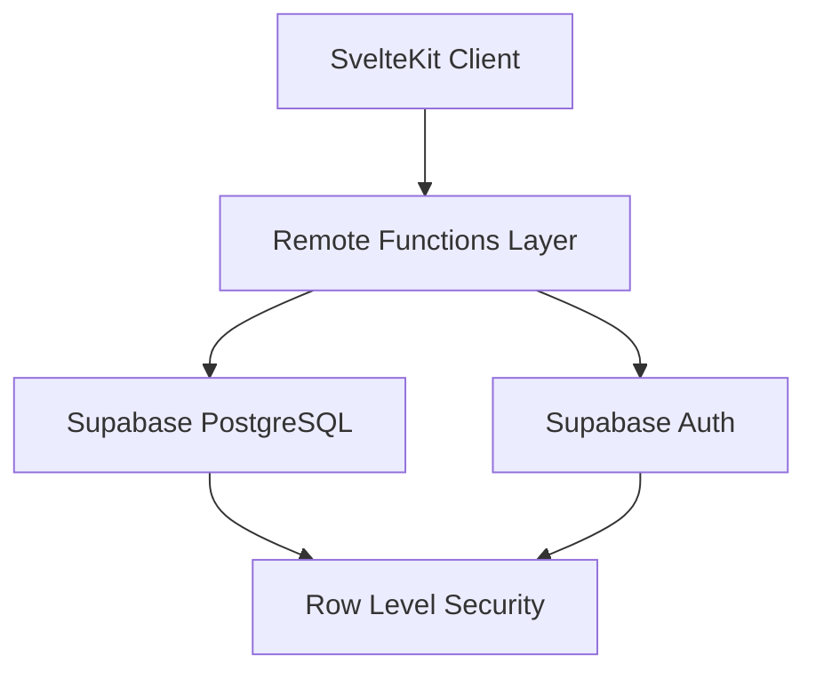

# Design Document

## Overview

The QSelf Dashboard is a modern web application built with SvelteKit 5 that implements a comprehensive quantified-self tracking system. The application leverages cutting-edge web technologies including SvelteKit Remote Functions for server-client communication, optimistic UI patterns for responsive user experience, and Supabase for backend services. The system is designed to track daily wellness activities (sleep, habits, mood, workouts) and provide intelligent scoring and insights.

The architecture follows a component-based design with reactive state management, timezone-aware data handling, and real-time UI updates. The application prioritizes user experience through optimistic updates, skeleton loading states, and seamless error handling.

## Architecture

### High-Level Architecture



### Technology Stack

- **Frontend Framework**: SvelteKit 5 with TypeScript
- **Styling**: Tailwind CSS v4 + daisyUI v5
- **Backend**: Supabase (PostgreSQL + Auth + RLS)
- **Database Access**: Drizzle ORM for complex queries, supabase-js for simple CRUD
- **Time Management**: Temporal API with Asia/Manila timezone
- **Development**: Bun for local development and testing
- **Deployment**: Vercel with Node runtime

### SvelteKit Configuration

The application requires specific SvelteKit configuration to enable Remote Functions and Async Svelte:

```javascript
// svelte.config.js
export default {
  compilerOptions: {
    experimental: {
      async: true  // Enable Async Svelte
    }
  },
  kit: {
    experimental: {
      remoteFunctions: true  // Enable Remote Functions
    }
  }
};
```

## Components and Interfaces

### Remote Functions Layer

The application uses SvelteKit Remote Functions to handle server-client communication with optimistic UI patterns:

#### Query Functions
- `getTodaySleep(localDate)` - Retrieves sleep data for a specific date
- `getTodayHabits(localDate)` - Retrieves habit completion status
- `getTodayMood(localDate)` - Retrieves mood rating
- `getTodayWorkouts(localDate)` - Retrieves workout completion status
- `getDayScore(localDate)` - Calculates and retrieves daily wellness score

#### Command Functions
- `upsertSleep(data)` - Creates or updates sleep records
- `upsertHabits(data)` - Updates habit completion status
- `upsertMood(data)` - Creates or updates mood records
- `upsertWorkouts(data)` - Updates workout completion status

#### Optimistic UI Pattern
All command functions implement optimistic updates using the native `withOverride()` method:

```typescript
// Example pattern for optimistic updates
async function handleSave(newData) {
  try {
    await upsertSleep(newData).updates(
      sleepData.withOverride(() => newData),
      dayScore.withOverride((score) => ({ 
        ...score, 
        sleep: calculateOptimisticSleepScore(newData)
      }))
    );
  } catch (error) {
    // Override automatically released on error
    showError('Failed to save');
  }
}
```

### Component Architecture

#### Dashboard Layout
- **Main Dashboard** (`+page.svelte`): Container for all tracking cards
- **Card Components**: Individual components for each tracking category
  - `SleepCard.svelte`
  - `HabitsCard.svelte`
  - `MoodCard.svelte`
  - `WorkoutsCard.svelte`
  - `DayScoreCard.svelte`

#### Card Component Pattern
Each card follows a consistent pattern:
- Independent data fetching using Remote Functions
- Optimistic UI updates with automatic rollback
- Edit/display mode switching
- Error handling with user feedback
- Loading states with skeleton components

### Authentication System

#### User Authentication
- Supabase Auth integration for user management
- Server-side user validation in Remote Functions
- Automatic session management

#### Authorization Helper
```typescript
// src/lib/server/auth.ts
export async function requireUser(event: RequestEvent) {
  const supabase = createSupabaseServerClient(event);
  const { data: { user }, error } = await supabase.auth.getUser();
  
  if (error || !user) {
    throw error(401, 'Authentication required');
  }
  
  return user;
}
```

## Data Models

### Database Schema (Drizzle ORM)

#### Sleep Logs Table
```typescript
export const sleepLogs = pgTable('sleep_logs', {
  id: serial('id').primaryKey(),
  userId: text('user_id').notNull(),
  localDate: text('local_date').notNull(),
  sleepStartLocal: text('sleep_start_local').notNull(),
  wakeTimeLocal: text('wake_time_local').notNull(),
  sleepStartTs: timestamp('sleep_start_ts', { withTimezone: true }).notNull(),
  wakeTs: timestamp('wake_ts', { withTimezone: true }).notNull(),
  durationMins: integer('duration_mins').notNull(),
  createdAt: timestamp('created_at').defaultNow(),
  updatedAt: timestamp('updated_at').defaultNow()
}, (table) => ({
  userDateUnique: unique().on(table.userId, table.localDate)
}));
```

#### Habits Table
```typescript
export const habits = pgTable('habits', {
  id: serial('id').primaryKey(),
  userId: text('user_id').notNull(),
  name: text('name').notNull(),
  weight: integer('weight').default(1),
  createdAt: timestamp('created_at').defaultNow()
});

export const habitLogs = pgTable('habit_logs', {
  id: serial('id').primaryKey(),
  userId: text('user_id').notNull(),
  habitId: integer('habit_id').references(() => habits.id),
  localDate: text('local_date').notNull(),
  completed: boolean('completed').default(false),
  completedAt: timestamp('completed_at'),
  createdAt: timestamp('created_at').defaultNow()
}, (table) => ({
  userHabitDateUnique: unique().on(table.userId, table.habitId, table.localDate)
}));
```

#### Mood Logs Table
```typescript
export const moodLogs = pgTable('mood_logs', {
  id: serial('id').primaryKey(),
  userId: text('user_id').notNull(),
  localDate: text('local_date').notNull(),
  rating: integer('rating').notNull(), // 1-5 scale
  createdAt: timestamp('created_at').defaultNow(),
  updatedAt: timestamp('updated_at').defaultNow()
}, (table) => ({
  userDateUnique: unique().on(table.userId, table.localDate)
}));
```

#### Workout Logs Table
```typescript
export const workoutLogs = pgTable('workout_logs', {
  id: serial('id').primaryKey(),
  userId: text('user_id').notNull(),
  localDate: text('local_date').notNull(),
  runningCompleted: boolean('running_completed').default(false),
  calisthenicsCompleted: boolean('calisthenics_completed').default(false),
  createdAt: timestamp('created_at').defaultNow(),
  updatedAt: timestamp('updated_at').defaultNow()
}, (table) => ({
  userDateUnique: unique().on(table.userId, table.localDate)
}));
```

### Row Level Security (RLS)

All tables implement RLS policies to ensure data isolation:

```sql
-- Enable RLS on all tables
ALTER TABLE "sleep_logs" ENABLE ROW LEVEL SECURITY;
ALTER TABLE "habits" ENABLE ROW LEVEL SECURITY;
ALTER TABLE "habit_logs" ENABLE ROW LEVEL SECURITY;
ALTER TABLE "mood_logs" ENABLE ROW LEVEL SECURITY;
ALTER TABLE "workout_logs" ENABLE ROW LEVEL SECURITY;

-- Create policies for user data isolation
CREATE POLICY "Users manage own sleep" ON "sleep_logs"
  FOR ALL TO authenticated 
  USING (auth.uid()::text = user_id);

CREATE POLICY "Users manage own habits" ON "habits"
  FOR ALL TO authenticated 
  USING (auth.uid()::text = user_id);

-- Similar policies for other tables...
```

### Time Management System

#### Temporal API Integration
```typescript
// src/lib/time/temporal.ts
import { Temporal } from '@js-temporal/polyfill';

export const MANILA_TZ = 'Asia/Manila';

export function getTodayLocalDate(): string {
  return Temporal.Now.plainDateISO(MANILA_TZ).toString();
}

export function localTimeToInstant(localDate: string, localTime: string): Temporal.Instant {
  const plainDateTime = Temporal.PlainDateTime.from(`${localDate}T${localTime}`);
  return plainDateTime.toZonedDateTime(MANILA_TZ).toInstant();
}

export function calculateSleepDuration(sleepStart: string, wakeTime: string, localDate: string): number {
  const sleepStartInstant = localTimeToInstant(localDate, sleepStart);
  let wakeInstant = localTimeToInstant(localDate, wakeTime);
  
  // Handle sleep that crosses midnight
  if (wakeInstant.epochMilliseconds <= sleepStartInstant.epochMilliseconds) {
    const nextDay = Temporal.PlainDate.from(localDate).add({ days: 1 }).toString();
    wakeInstant = localTimeToInstant(nextDay, wakeTime);
  }
  
  return Math.round((wakeInstant.epochMilliseconds - sleepStartInstant.epochMilliseconds) / (1000 * 60));
}
```

## Error Handling

### Global Error Boundary
```svelte
<!-- +layout.svelte -->
<svelte:boundary>
  {@render children()}
  
  {#snippet pending()}
    <div class="skeleton w-full h-32"></div>
  {/snippet}
  
  {#snippet failed(error)}
    <div class="alert alert-error">
      <span>{error.message}</span>
    </div>
  {/snippet}
</svelte:boundary>
```

### Component-Level Error Handling
- Local error states for specific operations
- User-friendly error messages
- Automatic retry mechanisms where appropriate
- Graceful degradation for non-critical features

### Error Types
- **Network Errors**: Connection issues, timeouts
- **Validation Errors**: Invalid input data
- **Authentication Errors**: Session expiry, unauthorized access
- **Database Errors**: Constraint violations, connection issues

## Testing Strategy

### Unit Testing
- **Remote Functions**: Test query and command functions with mock data
- **Time Utilities**: Test timezone conversions and duration calculations
- **Scoring Logic**: Test weighted scoring algorithms
- **Component Logic**: Test state management and user interactions

### Integration Testing
- **Database Operations**: Test CRUD operations with test database
- **Authentication Flow**: Test user login/logout scenarios
- **Optimistic UI**: Test update/rollback scenarios
- **Cross-component Communication**: Test data flow between components

### End-to-End Testing
- **User Workflows**: Complete tracking workflows from login to data entry
- **Data Persistence**: Verify data is correctly saved and retrieved
- **Error Scenarios**: Test error handling and recovery
- **Performance**: Test loading times and responsiveness

### Testing Tools
- **Vitest**: Unit and integration testing (run with `bun test`)
- **Playwright**: End-to-end testing
- **Testing Library**: Component testing utilities
- **MSW**: API mocking for tests
- **Bun**: Primary test runner and package manager for the project

## Scoring Algorithm

### Fixed Weights System (v1)
The daily score uses fixed weights for each component:
- Sleep: 30%
- Habits: 30%
- Mood: 20%
- Workouts: 20%

### Component Scoring Logic

#### Sleep Scoring
```typescript
function calculateSleepScore(durationMins: number): number {
  const hours = durationMins / 60;
  
  // Optimal range: 7-9 hours
  if (hours >= 7 && hours <= 9) return 100;
  if (hours >= 6 && hours < 7) return 80;
  if (hours >= 5 && hours < 6) return 60;
  if (hours >= 4 && hours < 5) return 40;
  if (hours > 9 && hours <= 10) return 80;
  if (hours > 10) return 60;
  
  return 20; // Less than 4 hours
}
```

#### Habits Scoring
```typescript
function calculateHabitsScore(completedHabits: HabitCompletion[]): number {
  if (completedHabits.length === 0) return 0;
  
  const totalWeight = completedHabits.reduce((sum, habit) => sum + habit.weight, 0);
  const completedWeight = completedHabits
    .filter(habit => habit.completed)
    .reduce((sum, habit) => sum + habit.weight, 0);
  
  return Math.round((completedWeight / totalWeight) * 100);
}
```

#### Mood Scoring
```typescript
function calculateMoodScore(rating: number): number {
  // Convert 1-5 scale to 0-100 percentage
  return Math.round(((rating - 1) / 4) * 100);
}
```

#### Workouts Scoring
```typescript
function calculateWorkoutsScore(running: boolean, calisthenics: boolean): number {
  if (running || calisthenics) return 100;
  return 0;
}
```

### Daily Score Calculation
```typescript
function calculateDayScore(components: ScoreComponents): DayScore {
  const totalScore = Math.round(
    components.sleep * 0.3 + 
    components.habits * 0.3 + 
    components.mood * 0.2 + 
    components.workouts * 0.2
  );
  
  return {
    total: totalScore,
    breakdown: components,
    tips: generateTips(components)
  };
}
```

## Performance Considerations

### Optimistic UI Benefits
- Immediate user feedback
- Reduced perceived latency
- Better user experience during network delays
- Automatic rollback on failures

### Caching Strategy
- Remote Functions provide built-in caching
- Single-flight updates prevent duplicate requests
- Efficient query invalidation

### Bundle Optimization
- Code splitting by route
- Tree shaking for unused code
- Optimized asset loading
- Minimal runtime overhead

### Database Performance
- Indexed queries on user_id and local_date
- Efficient RLS policies
- Connection pooling via Supabase
- Optimized query patterns with Drizzle ORM

This design provides a solid foundation for implementing the QSelf Dashboard with modern web technologies, ensuring scalability, maintainability, and excellent user experience.