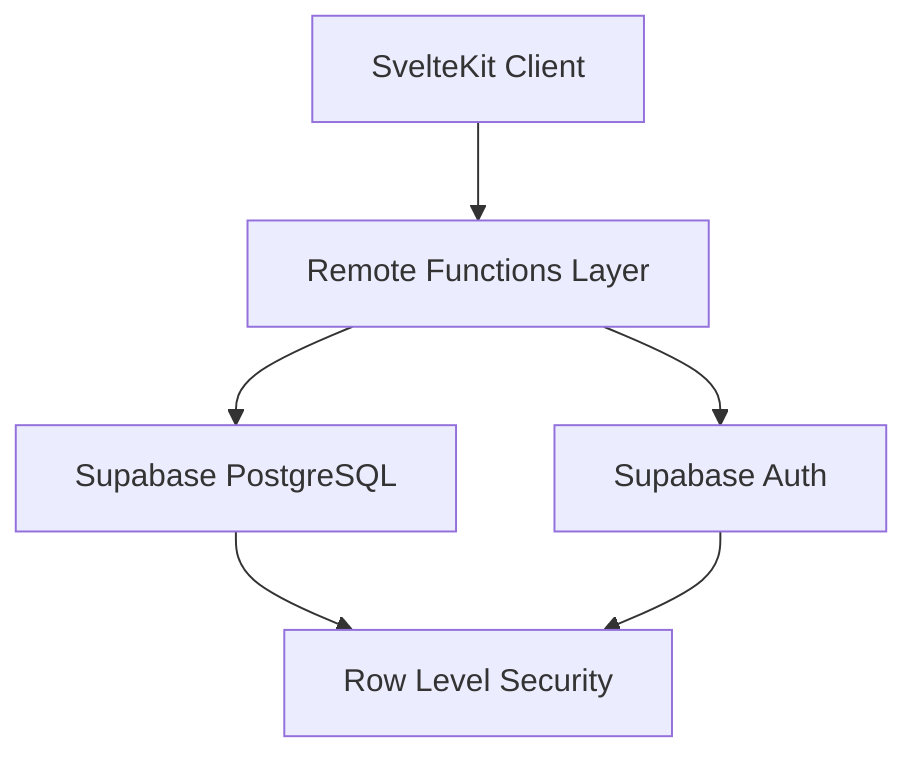

# Design Document

## Overview

The QSelf Dashboard is a premium, highly polished web application built with SvelteKit 5 that implements a comprehensive quantified-self tracking system with exceptional user experience. The application features a completely overhauled design system with sophisticated visual hierarchy, refined interactions, and comprehensive historical data visualization. It leverages cutting-edge web technologies including SvelteKit Remote Functions for server-client communication, optimistic UI patterns for responsive user experience, and Supabase for backend services.

The architecture follows a component-based design with reactive state management, timezone-aware data handling, real-time UI updates, and a premium design system that prioritizes accessibility, visual consistency, and user delight. The application implements a magnum opus approach to UI/UX with carefully crafted micro-interactions, sophisticated typography, and a cohesive visual language throughout.

## Architecture

### High-Level Architecture



### Technology Stack

- **Frontend Framework**: SvelteKit 5 with TypeScript
- **Styling**: Tailwind CSS v4 + daisyUI v5
- **Backend**: Supabase (PostgreSQL + Auth + RLS)
- **Database Access**: Drizzle ORM for complex queries, supabase-js for simple CRUD
- **Time Management**: Temporal API with Asia/Manila timezone
- **Development**: Bun for local development and testing
- **Deployment**: Vercel with Node runtime

### SvelteKit Configuration

The application requires specific SvelteKit configuration to enable Remote Functions and Async Svelte:

```javascript
// svelte.config.js
export default {
  compilerOptions: {
    experimental: {
      async: true  // Enable Async Svelte
    }
  },
  kit: {
    experimental: {
      remoteFunctions: true  // Enable Remote Functions
    }
  }
};
```

## Premium Design System

### Visual Design Philosophy

The application implements a sophisticated design system based on the following principles:

#### Color System
- **Primary Palette**: Deep charcoal (#1a1a1a) with subtle warm undertones
- **Accent Colors**: Carefully selected blues and greens for data visualization
- **Semantic Colors**: Consistent success, warning, and error states
- **Neutral Grays**: 8-step gray scale for text hierarchy and backgrounds
- **Interactive States**: Subtle color shifts for hover, active, and focus states

#### Typography System
```css
/* Primary Font Stack */
font-family: 'Inter Variable', -apple-system, BlinkMacSystemFont, 'Segoe UI', system-ui, sans-serif;

/* Type Scale */
--text-xs: 0.75rem;    /* 12px */
--text-sm: 0.875rem;   /* 14px */
--text-base: 1rem;     /* 16px */
--text-lg: 1.125rem;   /* 18px */
--text-xl: 1.25rem;    /* 20px */
--text-2xl: 1.5rem;    /* 24px */
--text-3xl: 1.875rem;  /* 30px */

/* Font Weights */
--font-light: 300;
--font-normal: 400;
--font-medium: 500;
--font-semibold: 600;
--font-bold: 700;
```

#### Spacing System
```css
/* 8px base unit spacing system */
--space-1: 0.25rem;   /* 4px */
--space-2: 0.5rem;    /* 8px */
--space-3: 0.75rem;   /* 12px */
--space-4: 1rem;      /* 16px */
--space-6: 1.5rem;    /* 24px */
--space-8: 2rem;      /* 32px */
--space-12: 3rem;     /* 48px */
--space-16: 4rem;     /* 64px */
```

#### Border Radius System
```css
--radius-sm: 0.25rem;   /* 4px */
--radius-md: 0.375rem;  /* 6px */
--radius-lg: 0.5rem;    /* 8px */
--radius-xl: 0.75rem;   /* 12px */
--radius-2xl: 1rem;     /* 16px */
```

### Component Design Patterns

#### Card Components
- **Elevated Surface**: Subtle shadows with layered depth
- **Refined Borders**: 1px borders with carefully selected opacity
- **Consistent Padding**: 24px internal spacing for optimal content breathing room
- **Hover States**: Subtle elevation changes without distracting glow effects
- **Focus States**: Clear accessibility indicators with proper contrast ratios

#### Interactive Elements
- **Buttons**: Multiple variants (primary, secondary, ghost) with consistent sizing
- **Form Inputs**: Clean, minimal design with clear validation states
- **Toggle Controls**: Smooth animations with satisfying tactile feedback
- **Navigation**: Clear hierarchy with intuitive interaction patterns

#### Data Visualization
- **Heatmap**: Clean grid layout with meaningful color encoding
- **Progress Indicators**: Smooth animations with clear completion states
- **Score Displays**: Prominent typography with supporting context
- **Charts**: Minimal, data-focused design with appropriate color coding

### Animation and Micro-interactions

#### Transition System
```css
/* Easing Functions */
--ease-out-cubic: cubic-bezier(0.33, 1, 0.68, 1);
--ease-in-out-cubic: cubic-bezier(0.65, 0, 0.35, 1);
--ease-spring: cubic-bezier(0.68, -0.55, 0.265, 1.55);

/* Duration Scale */
--duration-fast: 150ms;
--duration-normal: 250ms;
--duration-slow: 350ms;
```

#### Interaction Feedback
- **Button Press**: Subtle scale transform (0.98) with quick spring back
- **Card Hover**: Gentle elevation increase without glow effects
- **Form Focus**: Smooth border color transition with ring indicator
- **Loading States**: Elegant skeleton animations with proper timing
- **Success Actions**: Satisfying completion animations with appropriate duration

### Accessibility Design

#### Color Contrast
- **Text on Background**: Minimum 4.5:1 contrast ratio
- **Interactive Elements**: Minimum 3:1 contrast ratio
- **Focus Indicators**: High contrast with 2px minimum thickness
- **Color Blind Friendly**: Patterns and shapes supplement color coding

#### Keyboard Navigation
- **Tab Order**: Logical flow through interactive elements
- **Focus Management**: Clear visual indicators for all focusable elements
- **Keyboard Shortcuts**: Intuitive shortcuts for common actions
- **Screen Reader Support**: Proper ARIA labels and semantic HTML

#### Responsive Design
- **Mobile First**: Optimized touch targets (44px minimum)
- **Flexible Layouts**: Fluid grids that adapt to content
- **Readable Typography**: Appropriate font sizes across devices
- **Touch Gestures**: Intuitive swipe and tap interactions

## Components and Interfaces

### Remote Functions Layer

The application uses SvelteKit Remote Functions to handle server-client communication with optimistic UI patterns:

#### Query Functions
- `getTodaySleep(localDate)` - Retrieves sleep data for a specific date
- `getTodayHabits(localDate)` - Retrieves habit completion status
- `getTodayMood(localDate)` - Retrieves mood rating
- `getTodayWorkouts(localDate)` - Retrieves workout completion status
- `getDayScore(localDate)` - Calculates and retrieves daily wellness score
- `getHistoricalScores(startDate, endDate)` - Retrieves historical daily scores for heatmap visualization
- `getScoreTrends(days)` - Retrieves component score trends over specified period

#### Command Functions
- `upsertSleep(data)` - Creates or updates sleep records
- `upsertHabits(data)` - Updates habit completion status
- `upsertMood(data)` - Creates or updates mood records
- `upsertWorkouts(data)` - Updates workout completion status

#### Optimistic UI Pattern
All command functions implement optimistic updates using the native `withOverride()` method:

```typescript
// Example pattern for optimistic updates
async function handleSave(newData) {
  try {
    await upsertSleep(newData).updates(
      sleepData.withOverride(() => newData),
      dayScore.withOverride((score) => ({ 
        ...score, 
        sleep: calculateOptimisticSleepScore(newData)
      }))
    );
  } catch (error) {
    // Override automatically released on error
    showError('Failed to save');
  }
}
```

### Component Architecture

#### Dashboard Layout
- **Main Dashboard** (`+page.svelte`): Container for all tracking cards
- **Card Components**: Individual components for each tracking category
  - `SleepCard.svelte`
  - `HabitsCard.svelte`
  - `MoodCard.svelte`
  - `WorkoutsCard.svelte`
  - `DayScoreCard.svelte`

#### Card Component Pattern
Each card follows a consistent premium design pattern:
- **Independent Data Fetching**: Using Remote Functions with proper error boundaries
- **Optimistic UI Updates**: Immediate feedback with automatic rollback on failure
- **Refined Visual States**: Edit/display mode switching with smooth transitions
- **Sophisticated Error Handling**: Graceful error states with recovery options
- **Premium Loading States**: Elegant skeleton components with proper timing
- **Consistent Interaction Design**: Hover states without excessive glow effects
- **Accessibility Compliance**: Proper ARIA labels and keyboard navigation
- **Responsive Layout**: Optimal display across all device sizes

#### Enhanced UI Components

##### Premium Button Component
```svelte
<!-- Button.svelte -->
<script lang="ts">
  interface Props {
    variant?: 'primary' | 'secondary' | 'ghost' | 'danger';
    size?: 'sm' | 'md' | 'lg';
    disabled?: boolean;
    loading?: boolean;
    children: Snippet;
  }
  
  let { variant = 'primary', size = 'md', disabled = false, loading = false, children }: Props = $props();
</script>

<button 
  class="btn btn-{variant} btn-{size}"
  class:loading
  {disabled}
  onclick
>
  {@render children()}
</button>

<style>
  .btn {
    @apply inline-flex items-center justify-center font-medium transition-all duration-150;
    @apply focus:outline-none focus:ring-2 focus:ring-offset-2;
    @apply disabled:opacity-50 disabled:cursor-not-allowed;
    transform: translateY(0);
  }
  
  .btn:active:not(:disabled) {
    transform: translateY(1px) scale(0.98);
  }
  
  .btn-primary {
    @apply bg-blue-600 text-white hover:bg-blue-700 focus:ring-blue-500;
  }
  
  .btn-secondary {
    @apply bg-gray-200 text-gray-900 hover:bg-gray-300 focus:ring-gray-500;
  }
  
  .btn-ghost {
    @apply bg-transparent text-gray-700 hover:bg-gray-100 focus:ring-gray-500;
  }
  
  .btn-sm { @apply px-3 py-1.5 text-sm; }
  .btn-md { @apply px-4 py-2 text-base; }
  .btn-lg { @apply px-6 py-3 text-lg; }
</style>
```

##### Enhanced Panel Component
```svelte
<!-- Panel.svelte -->
<script lang="ts">
  interface Props {
    variant?: 'default' | 'elevated' | 'bordered';
    padding?: 'sm' | 'md' | 'lg';
    interactive?: boolean;
    children: Snippet;
  }
  
  let { variant = 'default', padding = 'md', interactive = false, children }: Props = $props();
</script>

<div 
  class="panel panel-{variant} panel-{padding}"
  class:interactive
  role={interactive ? 'button' : undefined}
  tabindex={interactive ? 0 : undefined}
>
  {@render children()}
</div>

<style>
  .panel {
    @apply rounded-xl transition-all duration-250;
  }
  
  .panel-default {
    @apply bg-white border border-gray-200;
  }
  
  .panel-elevated {
    @apply bg-white shadow-sm border border-gray-100;
  }
  
  .panel-bordered {
    @apply bg-white border-2 border-gray-200;
  }
  
  .interactive {
    @apply cursor-pointer;
  }
  
  .interactive:hover {
    @apply shadow-md border-gray-300;
    transform: translateY(-1px);
  }
  
  .interactive:focus {
    @apply outline-none ring-2 ring-blue-500 ring-offset-2;
  }
  
  .panel-sm { @apply p-4; }
  .panel-md { @apply p-6; }
  .panel-lg { @apply p-8; }
</style>
```

### Authentication System

#### User Authentication
- Supabase Auth integration for user management
- Server-side user validation in Remote Functions
- Automatic session management

#### Authorization Helper
```typescript
// src/lib/server/auth.ts
export async function requireUser(event: RequestEvent) {
  const supabase = createSupabaseServerClient(event);
  const { data: { user }, error } = await supabase.auth.getUser();
  
  if (error || !user) {
    throw error(401, 'Authentication required');
  }
  
  return user;
}
```

## Data Models

### Database Schema (Drizzle ORM)

#### Sleep Logs Table
```typescript
export const sleepLogs = pgTable('sleep_logs', {
  id: serial('id').primaryKey(),
  userId: text('user_id').notNull(),
  localDate: text('local_date').notNull(),
  sleepStartLocal: text('sleep_start_local').notNull(),
  wakeTimeLocal: text('wake_time_local').notNull(),
  sleepStartTs: timestamp('sleep_start_ts', { withTimezone: true }).notNull(),
  wakeTs: timestamp('wake_ts', { withTimezone: true }).notNull(),
  durationMins: integer('duration_mins').notNull(),
  createdAt: timestamp('created_at').defaultNow(),
  updatedAt: timestamp('updated_at').defaultNow()
}, (table) => ({
  userDateUnique: unique().on(table.userId, table.localDate)
}));
```

#### Habits Table
```typescript
export const habits = pgTable('habits', {
  id: serial('id').primaryKey(),
  userId: text('user_id').notNull(),
  name: text('name').notNull(),
  weight: integer('weight').default(1),
  createdAt: timestamp('created_at').defaultNow()
});

export const habitLogs = pgTable('habit_logs', {
  id: serial('id').primaryKey(),
  userId: text('user_id').notNull(),
  habitId: integer('habit_id').references(() => habits.id),
  localDate: text('local_date').notNull(),
  completed: boolean('completed').default(false),
  completedAt: timestamp('completed_at'),
  createdAt: timestamp('created_at').defaultNow()
}, (table) => ({
  userHabitDateUnique: unique().on(table.userId, table.habitId, table.localDate)
}));
```

#### Mood Logs Table
```typescript
export const moodLogs = pgTable('mood_logs', {
  id: serial('id').primaryKey(),
  userId: text('user_id').notNull(),
  localDate: text('local_date').notNull(),
  rating: integer('rating').notNull(), // 1-5 scale
  createdAt: timestamp('created_at').defaultNow(),
  updatedAt: timestamp('updated_at').defaultNow()
}, (table) => ({
  userDateUnique: unique().on(table.userId, table.localDate)
}));
```

#### Workout Logs Table
```typescript
export const workoutLogs = pgTable('workout_logs', {
  id: serial('id').primaryKey(),
  userId: text('user_id').notNull(),
  localDate: text('local_date').notNull(),
  runningCompleted: boolean('running_completed').default(false),
  calisthenicsCompleted: boolean('calisthenics_completed').default(false),
  createdAt: timestamp('created_at').defaultNow(),
  updatedAt: timestamp('updated_at').defaultNow()
}, (table) => ({
  userDateUnique: unique().on(table.userId, table.localDate)
}));
```

### Row Level Security (RLS)

All tables implement RLS policies to ensure data isolation:

```sql
-- Enable RLS on all tables
ALTER TABLE "sleep_logs" ENABLE ROW LEVEL SECURITY;
ALTER TABLE "habits" ENABLE ROW LEVEL SECURITY;
ALTER TABLE "habit_logs" ENABLE ROW LEVEL SECURITY;
ALTER TABLE "mood_logs" ENABLE ROW LEVEL SECURITY;
ALTER TABLE "workout_logs" ENABLE ROW LEVEL SECURITY;

-- Create policies for user data isolation
CREATE POLICY "Users manage own sleep" ON "sleep_logs"
  FOR ALL TO authenticated 
  USING (auth.uid()::text = user_id);

CREATE POLICY "Users manage own habits" ON "habits"
  FOR ALL TO authenticated 
  USING (auth.uid()::text = user_id);

-- Similar policies for other tables...
```

### Time Management System

#### Temporal API Integration
```typescript
// src/lib/time/temporal.ts
import { Temporal } from '@js-temporal/polyfill';

export const MANILA_TZ = 'Asia/Manila';

export function getTodayLocalDate(): string {
  return Temporal.Now.plainDateISO(MANILA_TZ).toString();
}

export function localTimeToInstant(localDate: string, localTime: string): Temporal.Instant {
  const plainDateTime = Temporal.PlainDateTime.from(`${localDate}T${localTime}`);
  return plainDateTime.toZonedDateTime(MANILA_TZ).toInstant();
}

export function calculateSleepDuration(sleepStart: string, wakeTime: string, localDate: string): number {
  const sleepStartInstant = localTimeToInstant(localDate, sleepStart);
  let wakeInstant = localTimeToInstant(localDate, wakeTime);
  
  // Handle sleep that crosses midnight
  if (wakeInstant.epochMilliseconds <= sleepStartInstant.epochMilliseconds) {
    const nextDay = Temporal.PlainDate.from(localDate).add({ days: 1 }).toString();
    wakeInstant = localTimeToInstant(nextDay, wakeTime);
  }
  
  return Math.round((wakeInstant.epochMilliseconds - sleepStartInstant.epochMilliseconds) / (1000 * 60));
}
```

## Error Handling

### Global Error Boundary
```svelte
<!-- +layout.svelte -->
<svelte:boundary>
  {@render children()}
  
  {#snippet pending()}
    <div class="skeleton w-full h-32"></div>
  {/snippet}
  
  {#snippet failed(error)}
    <div class="alert alert-error">
      <span>{error.message}</span>
    </div>
  {/snippet}
</svelte:boundary>
```

### Component-Level Error Handling
- Local error states for specific operations
- User-friendly error messages
- Automatic retry mechanisms where appropriate
- Graceful degradation for non-critical features

### Error Types
- **Network Errors**: Connection issues, timeouts
- **Validation Errors**: Invalid input data
- **Authentication Errors**: Session expiry, unauthorized access
- **Database Errors**: Constraint violations, connection issues

## Testing Strategy

### Unit Testing
- **Remote Functions**: Test query and command functions with mock data
- **Time Utilities**: Test timezone conversions and duration calculations
- **Scoring Logic**: Test weighted scoring algorithms
- **Component Logic**: Test state management and user interactions

### Integration Testing
- **Database Operations**: Test CRUD operations with test database
- **Authentication Flow**: Test user login/logout scenarios
- **Optimistic UI**: Test update/rollback scenarios
- **Cross-component Communication**: Test data flow between components

### End-to-End Testing
- **User Workflows**: Complete tracking workflows from login to data entry
- **Data Persistence**: Verify data is correctly saved and retrieved
- **Error Scenarios**: Test error handling and recovery
- **Performance**: Test loading times and responsiveness

### Testing Tools
- **Vitest**: Unit and integration testing (run with `bun test`)
- **Playwright**: End-to-end testing
- **Testing Library**: Component testing utilities
- **MSW**: API mocking for tests
- **Bun**: Primary test runner and package manager for the project

## Scoring Algorithm

### Fixed Weights System (v1)
The daily score uses fixed weights for each component:
- Sleep: 30%
- Habits: 30%
- Mood: 20%
- Workouts: 20%

### Component Scoring Logic

#### Sleep Scoring
```typescript
function calculateSleepScore(durationMins: number): number {
  const hours = durationMins / 60;
  
  // Optimal range: 7-9 hours
  if (hours >= 7 && hours <= 9) return 100;
  if (hours >= 6 && hours < 7) return 80;
  if (hours >= 5 && hours < 6) return 60;
  if (hours >= 4 && hours < 5) return 40;
  if (hours > 9 && hours <= 10) return 80;
  if (hours > 10) return 60;
  
  return 20; // Less than 4 hours
}
```

#### Habits Scoring
```typescript
function calculateHabitsScore(completedHabits: HabitCompletion[]): number {
  if (completedHabits.length === 0) return 0;
  
  const totalWeight = completedHabits.reduce((sum, habit) => sum + habit.weight, 0);
  const completedWeight = completedHabits
    .filter(habit => habit.completed)
    .reduce((sum, habit) => sum + habit.weight, 0);
  
  return Math.round((completedWeight / totalWeight) * 100);
}
```

#### Mood Scoring
```typescript
function calculateMoodScore(rating: number): number {
  // Convert 1-5 scale to 0-100 percentage
  return Math.round(((rating - 1) / 4) * 100);
}
```

#### Workouts Scoring
```typescript
function calculateWorkoutsScore(running: boolean, calisthenics: boolean): number {
  if (running || calisthenics) return 100;
  return 0;
}
```

### Daily Score Calculation
```typescript
function calculateDayScore(components: ScoreComponents): DayScore {
  const totalScore = Math.round(
    components.sleep * 0.3 + 
    components.habits * 0.3 + 
    components.mood * 0.2 + 
    components.workouts * 0.2
  );
  
  return {
    total: totalScore,
    breakdown: components,
    tips: generateTips(components)
  };
}
```

## Performance Considerations

### Optimistic UI Benefits
- Immediate user feedback
- Reduced perceived latency
- Better user experience during network delays
- Automatic rollback on failures

### Caching Strategy
- Remote Functions provide built-in caching
- Single-flight updates prevent duplicate requests
- Efficient query invalidation

### Bundle Optimization
- Code splitting by route
- Tree shaking for unused code
- Optimized asset loading
- Minimal runtime overhead

### Database Performance
- Indexed queries on user_id and local_date
- Efficient RLS policies
- Connection pooling via Supabase
- Optimized query patterns with Drizzle ORM

## Enhanced Historical Data Visualization

### Heatmap Component Design

#### Data Architecture for Historical Scores
```typescript
interface HistoricalScore {
  localDate: string;
  totalScore: number;
  breakdown: {
    sleep: number;
    habits: number;
    mood: number;
    workouts: number;
  };
  hasData: boolean;
}

interface HeatmapData {
  scores: HistoricalScore[];
  dateRange: {
    start: string;
    end: string;
  };
  maxScore: number;
}
```

#### Enhanced Remote Function for Historical Data
```typescript
// src/routes/historical-scores.remote.ts
import { requireUser } from '$lib/server/auth';
import { db } from '$lib/server/db';
import { calculateDayScore } from '$lib/scoring';

export async function getHistoricalScores(
  startDate: string, 
  endDate: string
): Promise<HeatmapData> {
  const user = await requireUser();
  
  // Fetch all component data for date range
  const [sleepData, habitsData, moodData, workoutData] = await Promise.all([
    db.query.sleepLogs.findMany({
      where: and(
        eq(sleepLogs.userId, user.id),
        gte(sleepLogs.localDate, startDate),
        lte(sleepLogs.localDate, endDate)
      )
    }),
    // Similar queries for habits, mood, workouts...
  ]);
  
  // Generate complete date range and calculate scores
  const scores: HistoricalScore[] = [];
  const currentDate = Temporal.PlainDate.from(startDate);
  const endDateObj = Temporal.PlainDate.from(endDate);
  
  while (Temporal.PlainDate.compare(currentDate, endDateObj) <= 0) {
    const dateStr = currentDate.toString();
    
    // Find data for this date
    const dayData = {
      sleep: sleepData.find(s => s.localDate === dateStr),
      habits: habitsData.filter(h => h.localDate === dateStr),
      mood: moodData.find(m => m.localDate === dateStr),
      workouts: workoutData.find(w => w.localDate === dateStr)
    };
    
    // Calculate score if any data exists
    const hasData = !!(dayData.sleep || dayData.habits.length || dayData.mood || dayData.workouts);
    const score = hasData ? calculateDayScore(dayData) : null;
    
    scores.push({
      localDate: dateStr,
      totalScore: score?.total || 0,
      breakdown: score?.breakdown || { sleep: 0, habits: 0, mood: 0, workouts: 0 },
      hasData
    });
    
    currentDate = currentDate.add({ days: 1 });
  }
  
  return {
    scores,
    dateRange: { start: startDate, end: endDate },
    maxScore: Math.max(...scores.map(s => s.totalScore))
  };
}
```

#### Premium Heatmap Component
```svelte
<!-- Heatmap.svelte -->
<script lang="ts">
  import { getHistoricalScores } from '../routes/historical-scores.remote';
  import { getTodayLocalDate } from '$lib/time/temporal';
  
  interface Props {
    days?: number;
  }
  
  let { days = 60 }: Props = $props();
  
  const today = getTodayLocalDate();
  const startDate = Temporal.PlainDate.from(today).subtract({ days: days - 1 }).toString();
  
  const historicalData = getHistoricalScores(startDate, today);
</script>

{#await historicalData}
  <div class="heatmap-skeleton">
    <div class="grid grid-cols-10 gap-1">
      {#each Array(60) as _}
        <div class="w-3 h-3 bg-gray-200 rounded-sm animate-pulse"></div>
      {/each}
    </div>
  </div>
{:then data}
  <div class="heatmap-container">
    <div class="heatmap-grid">
      {#each data.scores as score}
        <div 
          class="heatmap-cell"
          class:has-data={score.hasData}
          class:no-data={!score.hasData}
          style="--intensity: {score.hasData ? score.totalScore / 100 : 0}"
          title="{score.localDate}: {score.hasData ? `${score.totalScore}%` : 'No data'}"
        >
        </div>
      {/each}
    </div>
    
    <div class="heatmap-legend">
      <span class="text-xs text-gray-500">Less</span>
      <div class="legend-scale">
        {#each [0, 0.25, 0.5, 0.75, 1] as intensity}
          <div 
            class="legend-cell"
            style="--intensity: {intensity}"
          ></div>
        {/each}
      </div>
      <span class="text-xs text-gray-500">More</span>
    </div>
  </div>
{:catch error}
  <div class="heatmap-error">
    <p class="text-sm text-red-600">Failed to load historical data</p>
    <button class="text-xs text-blue-600 hover:underline" onclick={() => location.reload()}>
      Retry
    </button>
  </div>
{/await}

<style>
  .heatmap-container {
    @apply space-y-3;
  }
  
  .heatmap-grid {
    display: grid;
    grid-template-columns: repeat(10, 1fr);
    gap: 2px;
  }
  
  .heatmap-cell {
    @apply w-3 h-3 rounded-sm transition-all duration-150;
    background-color: hsl(142, calc(var(--intensity) * 70%), calc(85% - var(--intensity) * 35%));
  }
  
  .heatmap-cell.no-data {
    @apply bg-gray-100 border border-gray-200;
  }
  
  .heatmap-cell:hover {
    @apply scale-110 ring-1 ring-gray-400;
  }
  
  .heatmap-legend {
    @apply flex items-center justify-center space-x-2;
  }
  
  .legend-scale {
    @apply flex space-x-1;
  }
  
  .legend-cell {
    @apply w-2 h-2 rounded-sm;
    background-color: hsl(142, calc(var(--intensity) * 70%), calc(85% - var(--intensity) * 35%));
  }
  
  .heatmap-skeleton {
    @apply animate-pulse;
  }
  
  .heatmap-error {
    @apply text-center space-y-2 p-4 bg-red-50 rounded-lg border border-red-200;
  }
</style>
```

### Trend Visualization Components

#### Score Trend Chart
```svelte
<!-- ScoreTrend.svelte -->
<script lang="ts">
  import { getScoreTrends } from '../routes/score-trends.remote';
  
  interface Props {
    days?: number;
    component?: 'total' | 'sleep' | 'habits' | 'mood' | 'workouts';
  }
  
  let { days = 30, component = 'total' }: Props = $props();
  
  const trendData = getScoreTrends(days);
</script>

{#await trendData}
  <div class="trend-skeleton">
    <div class="h-32 bg-gray-200 rounded animate-pulse"></div>
  </div>
{:then data}
  <div class="trend-chart">
    <svg viewBox="0 0 400 120" class="w-full h-32">
      <!-- Trend line implementation -->
      <polyline 
        points={data.points}
        fill="none" 
        stroke="currentColor" 
        stroke-width="2"
        class="text-blue-600"
      />
      
      <!-- Data points -->
      {#each data.dataPoints as point, i}
        <circle 
          cx={point.x} 
          cy={point.y} 
          r="3"
          class="fill-blue-600 hover:fill-blue-800 transition-colors"
          title="{point.date}: {point.value}%"
        />
      {/each}
    </svg>
    
    <div class="trend-summary">
      <div class="flex justify-between text-sm text-gray-600">
        <span>Avg: {data.average}%</span>
        <span>Trend: {data.trend > 0 ? '↗' : data.trend < 0 ? '↘' : '→'}</span>
      </div>
    </div>
  </div>
{/await}

<style>
  .trend-chart {
    @apply space-y-2;
  }
  
  .trend-skeleton {
    @apply animate-pulse;
  }
  
  .trend-summary {
    @apply pt-2 border-t border-gray-200;
  }
</style>
```

## Performance and Optimization

### Advanced Caching Strategy
- **Historical Data Caching**: Cache historical scores with smart invalidation
- **Component-Level Caching**: Individual component data caching with TTL
- **Optimistic Updates**: Immediate UI updates with server reconciliation
- **Background Refresh**: Periodic data refresh without blocking UI

### Bundle Optimization
- **Code Splitting**: Route-based and component-based splitting
- **Tree Shaking**: Eliminate unused code from final bundle
- **Asset Optimization**: Optimized images, fonts, and static assets
- **Critical CSS**: Inline critical styles for faster initial render

### Accessibility Enhancements
- **Screen Reader Support**: Comprehensive ARIA labels and descriptions
- **Keyboard Navigation**: Full keyboard accessibility with logical tab order
- **High Contrast Mode**: Support for system high contrast preferences
- **Reduced Motion**: Respect user's motion preferences
- **Focus Management**: Proper focus handling for dynamic content

This comprehensive design provides a premium foundation for implementing the QSelf Dashboard with exceptional user experience, sophisticated visual design, and robust historical data visualization capabilities.